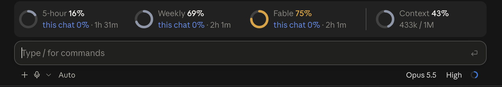

# nodworks — Claude Code plugins



Plugins for [Claude Code](https://code.claude.com) by Nodworks DevLabs.

```
/plugin marketplace add nodworks-devlabs/claude-plugins
/plugin install limit-meter@nodworks
```

If `marketplace add` fails with `Permission denied (publickey)`, you have no SSH key for GitHub; add it over HTTPS instead:

```
/plugin marketplace add https://github.com/nodworks-devlabs/claude-plugins.git
```

| Plugin | What it does |
| --- | --- |
| [limit-meter](plugins/limit-meter) | Rings above the prompt for your 5-hour, weekly and per-model limits and the context window, with what this chat, its project and its threads used. |

A plugin is code that runs inside Claude Code on your machine. Read it before you install it.
